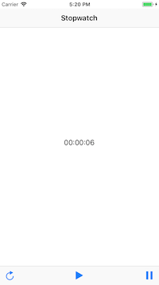

# The Complete iOS Developer Course

29.5 hours of lecture to learn Xcode and Swift (https://www.udemy.com/the-complete-ios-9-developer-course/learn/v4/overview)

## Completed Apps:

### [Stopwatch](https://github.com/mariesta/app-development/tree/master/Timer%20App) :

Simple app to start, pause and refresh a stopwatch using the [Timer](https://developer.apple.com/documentation/foundation/timer) class.

### [To Do List](https://github.com/mariesta/app-development/tree/master/To%20Do%20List) :

Very basic to do list app. You can add and remove items. Also uses persistent storage with [User Defaults](https://developer.apple.com/documentation/foundation/userdefaults).

### [Weather Forecast](https://github.com/mariesta/app-development/tree/master/Weather%20Forecast) :

Extracts the weather forecast from https://www.weather-forecast.com.

### [Tic Tac Toe](https://github.com/mariesta/app-development/tree/master/TicTacToe) :

Basic Tic Tac Toe game with noughts and crosses involving two players. Built using [tags](https://developer.apple.com/documentation/uikit/uiview/1622493-tag).

### [Map](https://github.com/mariesta/app-development/tree/master/Map) :

A map with two pins: one for the WorkIn Coworking Space in Seville and the other for the user's current location. Built using [MKMapView](https://developer.apple.com/documentation/mapkit/mkmapview).

